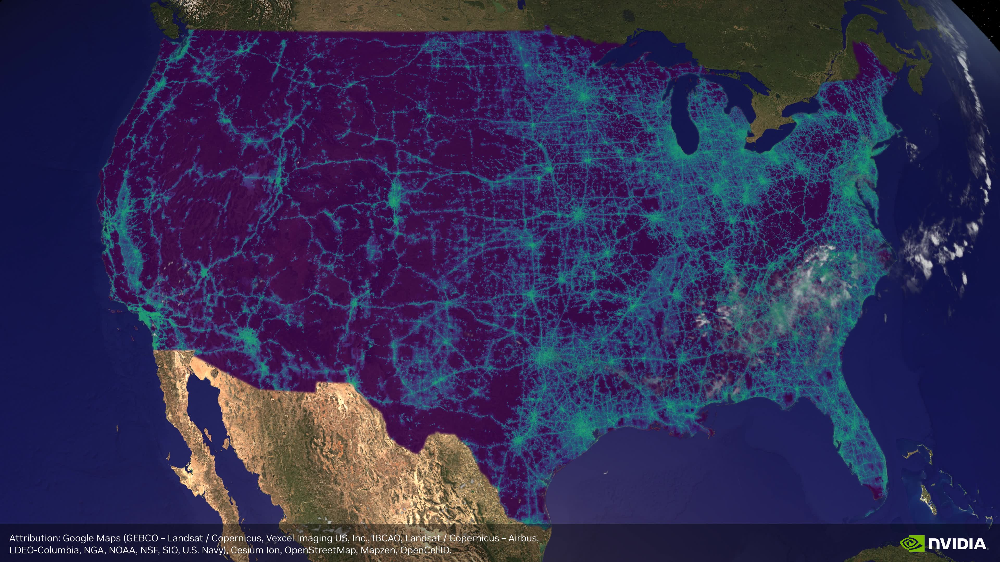

<br />
<p align="center">

  <h1 align="center"> Large-Scale Radio Map Computation using Sionna RT </h1>

  

  <p align="center">
    Radio map of the 4G/5G coverage of the US mainland, simulated using data from OpenCellID.
  </p>

</p>

<br />
<br />


Overview
========

This repository contains a collection of scripts to compute radio maps over large geographic areas using [Sionna RT](https://github.com/NVlabs/sionna-rt), NVIDIA's ray-tracing based radio propagation simulator.
Given the GPS coordinates of the region of interest and a dataset of base stations, the scripts adaptively subdivide the area into tiles, generates Sionna RT scenes for each tile and compute radio maps for each tile.

<!-- TABLE OF CONTENTS -->
<details open="open" style='padding: 15px; border-radius:5px; border-style: solid; border-width: 1px;'>
  <summary> The pipeline works in the following steps: </summary>
  <ol>
    <li><a href="#tiling-the-region-of-interest">Subdivide the region of interest into tiles<a/>
    <li><a href="#generating-scenes">Generate Sionna RT scenes for each tile</a>
    <li>(Optional) <a href="#optional-base-station-elevation">Estimate elevation for each base station if unknown</a>
    <li><a href="#computing-radio-maps">Compute radio maps for each tile using Sionna RT</a>
  </ol>
</details>

Preamble: folder structure
==========================

This repository is designed to generate and handle large amounts of data, so it follows a specific folder structure. 
In particular, it assumes that data is stored in a subfolder called `data` that is not tracked by `git`, with the following structure:

```#bash
data
├── local
│   └── scenes
└── remote
    ├── outputs
    ├── scenes
    └── transmitters
```

where `local` is intended to only contain data generated or processed locally, while the `remote` folder is intended to be stored on the cloud e.g., on a S3 storage node. The subfolders have the following purpose:

- `data/local/scenes`: contains uncompressed Sionna RT scenes generated for each tile.
- `data/remote/scenes`: contains compressed Sionna RT scenes that may be downloaded and uncompressed locally before use.
- `data/remote/outputs`: contains the outputs of various scripts e.g., computed radio maps or area tiling information.
- `data/remote/transmitters`: contains datasets of base stations used for the simulations.


For convenience, we define variables pointing to these folders in `sionna_lrm/__init__.py` that are used in various parts of the codebase. Unless otherwise specified, all paths to data files or folders mentioned in this document are relative to these variables.
The path to the `data` folder can be changed by setting the environment variable `SLRM_DATA_DIR` to point to the desired location. `sionna_lrm/constants.py`. We also provide various default values for the scripts in `sionna_lrm/constants.py` that can be modified as needed. In particular, to avoid the repetition of passing the path to the base station dataset in every script, we define the variable [`DEFAULT_TRANSMITTERS_FNAME`](sionna_lrm/constants.py#L35-37) in that file, which may be modified to point to the desired dataset.


Base stations
=============

To use this repository, you will need to provide a dataset of base stations in a CSV format. The required columns are:
- `lat`: latitude of the base station in degrees.
- `lon`: longitude of the base station in degrees.
- `height`: absolute altitude of the base station in meters.
- `building`: A boolean indicating whether the base station is located on top of a building (1) or on the ground (0).

You can generate this dataset from your own data, or use public datasets, such as the [OpenCellID](https://opencellid.org/) dataset, which contains millions of crowdsourced base station locations worldwide.

Once that dataset is ready, place it in the `data/remote/transmitters/` folder and update the [`DEFAULT_TRANSMITTERS_FNAME`](sionna_lrm/constants.py#L35-37) variable in `sionna_lrm/constants.py` to point to it.


(Optional) Base station elevation
---------------------------------

Depending on the data source (e.g., OpenCellID), you may not get an elevation field for each base station.
In that case, we provide a script to estimate it based on the terrain and building data in the Sionna RT scenes. In order to use it, you must first run the [scene generation scripts](#generating-scenes) and then run the following: 

```bash
python scripts/elevation_from_geometry.py -t <path_to_base_stations_csv> -b <path_to_tile_corners_npz> -o <path_to_updated_csv> SCENES_DIR
```

The script will then use ray tracing to determine a plausible elvation for each base station based on the terrain and potential buildings under it.


Tiling the region of interest
=============================

```bash
python scripts/generate_tiling.py --bbox <south> <west> <north> <east> <output_name>.npz
```
where `south`, `west`, `north`, `east` are the corresponding bounds of the area of interest in degrees, i.e. the south-west corner of the box is located at GPS coordinates (`south`, `west`) and likewise for the north-east corner.

This will create an adaptive tiling of the area based on the density of base stations. The output is a NPZ file containing an array of bounding box coordinates, one for each tile.

For large and complex areas, it may be useful to restrict the tiling to a valid region defined by a shapefile e.g., the outline of a country or region. You can do so by adding the `--shapefile <path_to_shapefile>` argument to the command above. Such files can be obtained from various sources, such as [Natural Earth](https://www.naturalearthdata.com/downloads/10m-cultural-vectors/).

Once generated, the tiling will be stored to `data/remote/outputs/<output_name>.npz`. You can visualize it using the Jupyter notebook in `notebooks/visualize_tiling.ipynb`.


Generating scenes
=================

Generate the Sionna scenes for each tile:
```bash
python scripts/scene_builder.py file <path_to_tile_corners_npz>  --subdir <area_name>
```
Here and in the rest of this document, `<area_name>` refers to a user-defined name for the region of interest.

This will generate one folder for each tile under `data/local/scenes/<area_name>/<tile_index>`, where `<tile_index>` is the index of the tile in the NPZ file.

Each folder has the following structure:
```bash
data/local/scenes/<area_name>/<tile_index>
├── mesh
│   ├── buildings.ply # All buildings in the tile extracted from OpenStreetMap
│   ├── ground_buffer_0.ply # South buffer ground mesh
│   ├── ground_buffer_1.ply # North buffer ground mesh
│   ├── ground_buffer_2.ply # West buffer ground mesh
│   ├── ground_buffer_3.ply # East buffer ground mesh
│   ├── ground.ply # Ground mesh covering the tile, will act as measurement surface
│   └── water.ply # Water bodies mesh
└── scene.xml # Mitsuba 3 scene description file
```

In order to save space on the local machine, the default behavior of this script is to compress each generated scene and move it to the `data/remote/scenes/<area_name>/` folder. The local (uncompressed) copy is then deleted. You can modify this behavior using the `--no-compress` and `--keep-local` arguments.


:warning: Depending on the user's setup and size of the region of interest, running the script can be extremely time consuming. In particular, the script needs to query OpenStreetMap data for each tile, which can quickly become a bottleneck because of rate limits on the public server. In that case, it may be beneficial to setup [your own instance](https://wiki.openstreetmap.org/wiki/Overpass_API/Installation) of the OverPass server, which allows you to overcome these rate limits. In that case, you can add the `--osm-server-addr http://<server_ip>/api/interpreter` argument to the script above to query that server instead of the public one.

For the complete list of available arguments, run:

```bash
python scripts/scene_builder.py file --help
```

Generating a single tile
------------------------
The scene generation script may also be used to generate individual tiles, in one of the two following ways:

```bash
python scripts/scene_builder.py bbox <south> <west> <north> <east> --scene-name <scene_name>
```

This will generate a scene for the bounding box defined by the given GPS coordinates.

```bash
python scripts/scene_builder.py point <lat> <lon> <height> <width> --scene-name <scene_name>
```

This will generate a scene for a tile whose south-west corner is located at the given GPS coordinates, and whose size is defined by `width` (along the longitude axis) and `height` (along the latitude axis), in meters.


Computing radio maps
====================

Data preparation
----------------

If the radio maps are to be computed on a different machine than the one used to generate the scenes, the scenes must first be extracted from their compressed format. You can do so by running the following command:

```bash
python scripts/compute_radio_maps.py data/local/scenes/us -o ./tmp/unused --extract-scenes-only
```

Running on a single machine
---------------------------

To compute radio maps on a single machine, simply run:

```bash
python scripts/compute_radio_maps.py -s data/local/scenes/<region_name> -o <output_folder>
```

Running on a cluster
--------------------

We also provide scripts to distribute the radio map computations over a SLURM GPU cluster. The scripts may need to be adapted to the specific cluster configuration and are therefore provided as examples rather than ready-to-use solutions.
The relevant scripts are located in the `scripts/slurm` folder.

:warning: This step greatly benefits from running on a cluster node with NVIDIA GPUs with RTX cores (e.g., L40S). Running it with non-RTX 
GPUs (e.g., H100) is possible but will be slower.

First, modify lines 22 and 23 of the file [`scripts/slurm/submit_radio_maps.py`](./scripts/slurm/submit_radio_maps.py#L22-23) to use your desired partition and account name, as well as [line 34](./scripts/slurm/submit_radio_maps.py#L34) to set the path to the repo's root folder on the cluster.

You can then submit the job as follows:

```bash
# Submit 8 jobs (= 8 nodes) with 4 GPUs each.
python scripts/slurm/submit_radio_maps.py -s data/local/scenes/us_new/<area_name> -o <output_dir> -j8 -g4
```

You can monitor the progress of the jobs by running:

```bash
python scripts/slurm/watch_jobs_progress.py <output_dir>
```

### About the work queue

The `submit_radio_maps.py` script creates one small JSON file for each radio map to be computed (i.e. for each tile / scene) in the directory `<output_dir>/pending`. It submits `J` jobs.
Once a job starts on a node, it starts `G` independent processes of `radio_maps_worker.py`, one per GPU, using the environment variable `CUDA_VISIBLE_DEVICES` to ensure the correct GPU is used.
The worker thread lists the JSON files in `<output_dir>/pending` and tries claiming one at random by moving it to `<output_dir>/processing`. Finally, the JSON file is moved to either `<output_dir>/done` or `<output_dir>/failed`, with additional information about the job.

Troubleshooting
===============

If you encounter issues while running the scripts, please refer to the [Troubleshooting](TROUBLESHOOTING.md) guide for common problems and their solutions.


License
=======

This repository contains code adapted from [geo2sigmap](https://github.com/functions-lab/geo2sigmap) and is released under the Apache 2.0 License. Please see the [LICENSE](LICENSE) file for more details.

